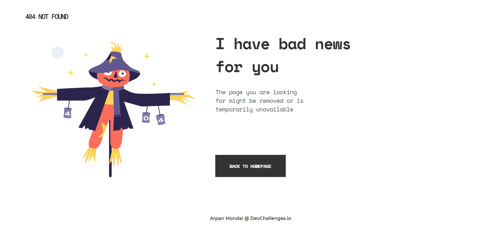

<!-- Please update value in the {}  -->

<h1 align="center">404-Not-Found</h1>

   Solution for a challenge from  <a href="http://devchallenges.io" target="_blank">Devchallenges.io</a>.

 

  <h3>
    <a href="https://404-not-found-arpan.netlify.app/">
      Demo
    </a>
     | 
    <a href="https://github.com/arp99/404-Not-Found">
      Solution
    </a>
     | 
    <a href="https://devchallenges.io/challenges/wBunSb7FPrIepJZAg0sY">
      Challenge
    </a>
  </h3>

<!-- OVERVIEW -->

## Overview

- For demo <a href="https://404-not-found-arpan.netlify.app/">Click Here</a>
- First time developing frontend by following a Figma prototype. It was a great experience and learning for me.
- Learnt to effectively do responsive design
- Practice practice, do not look back

### Built With

<!-- This section should list any major frameworks that you built your project using. Here are a few examples.-->
- HTML
- CSS

## Features

<!-- List the features of your application or follow the template. Don't share the figma file here :) -->

This application/site was created as a submission to a [DevChallenges](https://devchallenges.io/challenges) challenge. The [challenge](https://devchallenges.io/challenges/wBunSb7FPrIepJZAg0sY) was to build an application to complete the given user stories.

## Acknowledgements

<!-- This section should list any articles or add-ons/plugins that helps you to complete the project. This is optional but it will help you in the future. For exmpale -->

- [Steps to replicate a design with only HTML and CSS](https://devchallenges-blogs.web.app/how-to-replicate-design/)

## Contact

- Website [Portfolio](https://arpan-portfolio.netlify.app/)
- GitHub [arp99](https://github.com/arp99)
- Twitter [Follow me](https://twitter.com/arpanmondal25)
